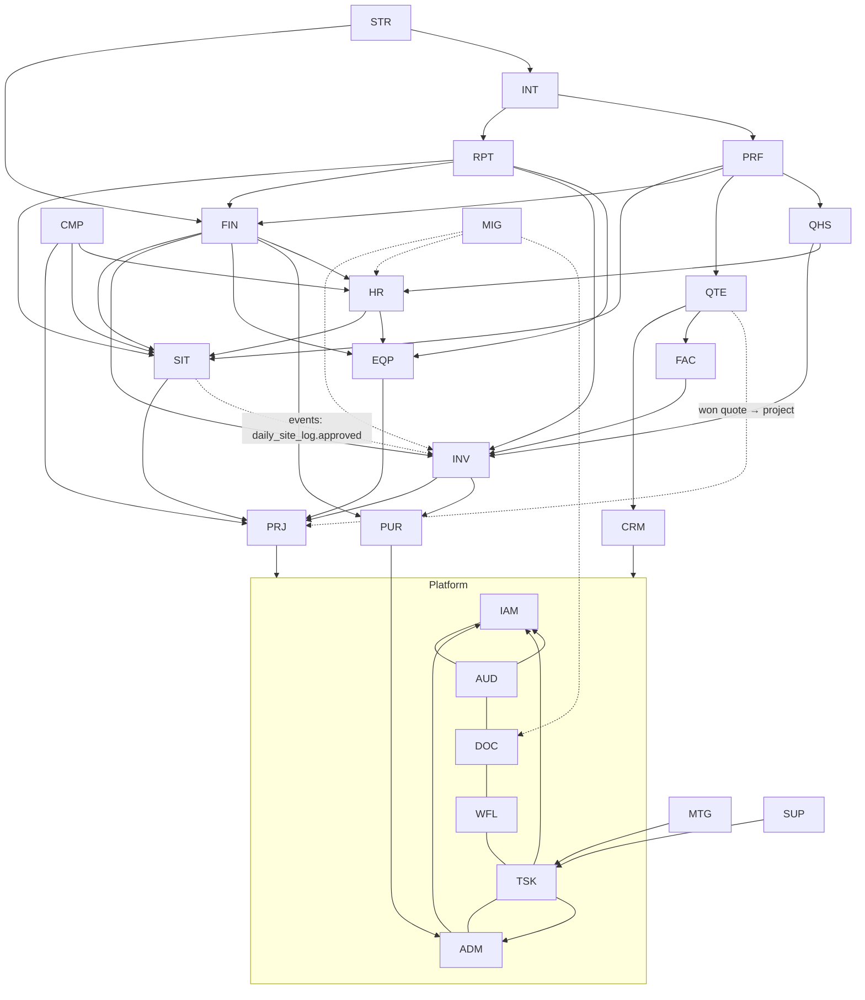

# Modül Haritası ve Bağımlılık Grafiği

Durum: Taslak (Phase 03'te kesinleşir) · 2026-09-15

Mimari: modüler monolit (ADR-001). Bir modül başka modülün tablosuna doğrudan erişemez; açık uygulama arayüzünü kullanır veya olayına abone olur.

## Modüller

| Kod | Modül | Sorumluluk | Gereksinimler |
|---|---|---|---|
| **Platform** | | | |
| IAM | Identity & Access | Kullanıcı, dinamik rol, çoklu/vekâleten rol, görünürlük, 2FA, oturum | `docs/requirements/REQ-IAM.md` |
| AUD | Audit & History | Değişiklik geçmişi, denetim kayıtları, revizyon talepleri | `docs/requirements/REQ-AUD.md` |
| DOC | Documents & Archive | Belge depolama, sürüm, kayda bağlı belgeler, tek pencere arşiv | `docs/requirements/REQ-DOC.md` |
| WFL | Workflow & Rules | Görsel iş akışı motoru, onay merkezi, merkezi kurallar, bağımlılık kilitleri | `docs/requirements/REQ-WFL.md` |
| TSK | Tasks & Notifications | Görevler, bildirim merkezi, eskalasyon, günlük özet | `docs/requirements/REQ-TSK.md` |
| ADM | Master Data & Settings | Merkezi tanımlar, kataloglar, özel alanlar, çalışma takvimi, döviz kuru | `docs/requirements/REQ-ADM.md` |
| **Operasyon** | | | |
| PRJ | Projects | Proje kartı, duvarlar, hedefler, iş programı, tedarik matrisi, teknik ofis | `docs/requirements/REQ-PRJ.md` |
| SIT | Site Operations | Günlük saha kaydı, döküm, montaj, şerit, teslim-tesellüm, faaliyet süreleri, zayi, saha harcaması, onay/düzeltme, taşeron/öz kaynak modeli | `docs/requirements/REQ-SIT.md` |
| INV | Inventory | Malzeme kataloğu, lokasyonlu stok defteri, kantar/tır, sayım, açılış, kombinasyon, tüketim maliyeti, sarf reçetesi, fire/hurda | `docs/requirements/REQ-INV.md` |
| PUR | Purchasing | Tedarikçiler, siparişler, genel satın alma talepleri | `docs/requirements/REQ-PUR.md` |
| FAC | Factory | Fabrika günlük kaydı, şerit/lug üretim zinciri, birim maliyet, teknik iyileştirme işleri | `docs/requirements/REQ-FAC.md` |
| EQP | Equipment & Vehicles | Envanter kartı, transfer, amortisman, bakım, vinç günlük kaydı, araç zimmet/devir, atıl kaynak | `docs/requirements/REQ-EQP.md` |
| **Ticari & Finans** | | | |
| CRM | Leads & Clients | Talep/iletişim günlüğü, işveren kartı ve karnesi, ihale takibi | `docs/requirements/REQ-CRM.md` |
| QTE | Quotes & Sales | Teklif, marj, çoklu kur, teklif belgesi, maliyet geri beslemesi, ürün satışı | `docs/requirements/REQ-QTE.md` |
| FIN | Finance | Hakediş (işveren/taşeron), gelir/gider, yan gelir, cari, nakit projeksiyonu, fatura/ödeme takibi, dönem kapanışı | `docs/requirements/REQ-FIN.md` |
| **Kurumsal** | | | |
| HR | Human Resources | Personel kartı, puantaj, bordro, izin, giriş/çıkış checklist, zimmet uyarısı, faaliyet raporu | `docs/requirements/REQ-HR.md` |
| CMP | Contracts & Compliance | Sözleşme şartları, yükümlülükler, tetikleyiciler, işveren gecikme kanıtı, teminat, süreli belgeler | `docs/requirements/REQ-CMP.md` |
| QHS | Quality & OHS | Sertifikalar, saha kalite kontrolleri, uygunsuzluk/DÖF, İSG olayları, eğitimler | `docs/requirements/REQ-QHS.md` |
| MTG | Meetings & Decisions | Toplantı kaydı, kararlar, karar takibi | `docs/requirements/REQ-MTG.md` |
| SUP | Internal Support | İç destek talepleri, mesajlaşma, sevk | `docs/requirements/REQ-SUP.md` |
| **Analiz & Yönetim** | | | |
| RPT | Reporting & Cockpit | Sahip cockpit'i, dikkat bölümü, şantiye detayı/tanı, resmi günlük rapor, raporlar, dışa aktarım | `docs/requirements/REQ-RPT.md` |
| PRF | Performance | Metrikler, KPI kataloğu, sıralama, hedef ve prim | `docs/requirements/REQ-PRF.md` |
| INT | Intelligence | Öneriler, hızlandırma senaryoları, kaynak optimizasyonu | `docs/requirements/REQ-INT.md` |
| STR | Strategy & Planning | Yıllık hedefler, bütçe-gerçekleşen, yatırım analizi, what-if, şirket sağlık karnesi | `docs/requirements/REQ-STR.md` |
| **Ertelenen** | | | |
| MIG | Data Import | Excel / eski panel / Drive aktarımı (DEF-001) | — (ertelendi, DEF-001) |

## Bağımlılık grafiği

Oklar "şuna bağımlıdır / şunu okur" anlamındadır. Platform modülleri arasındaki ok da açıkça yazılır: denetim ekranı ve geçmiş servisi yetkiyi IAM'e sorar (`AUD --> IAM`, ve aynı nedenle tanımlar servisi için `ADM --> IAM`, TASK-0105; görev servisi için `TSK --> IAM`, ve günlük özet saati ile eskalasyon bekleme süresi tarihli kural olduğu için `TSK --> ADM`, TASK-0108); IAM kendi olaylarını denetime veritabanı işlevleriyle yazar ve AUD'yi kodda çağırmaz, böylece döngü olmaz (TASK-0103, D-258). Aynı nedenle IAM kendi güvenlik ayarlarını da (hatalı giriş sınırı, kilit süresi, oturum ömrü ve hareketsizlik süresi) kodda ADM'ye sormaz: tanımlayıcı işlevleri `adm.rule_value`'yu SQL'de okur (TASK-0112, göç 0039). Böylece hem `IAM --> ADM` oku gerekmez hem de güvenlik eşiği çağıranın elinde olmaz. Tüm iş modülleri platform modüllerine (IAM, AUD, DOC, WFL, TSK, ADM) bağımlıdır; grafik okunabilirlik için bunu tek kutuda gösterir.

## Temel olay akışları (taslak)

| Olay | Yayınlayan | Tepki veren |
|---|---|---|
| `daily_site_log.approved` | SIT | INV (tüketim), FIN (hakediş önerisi, taşeron hakedişi, maliyet), HR (puantaj), PRF (metrikler), RPT (özetler) |
| `stock_movement.recorded` | INV | FIN (maliyet), RPT, INT (kritik stok) |
| `progress_payment.approved_by_client` | FIN | TSK/WFL (fatura görevi) |
| `employee.offboarding_started` | HR | CMP (tetikleyici checklist), EQP (zimmet kontrolü) |
| `quote.won` | QTE | PRJ (proje başlangıcı), CMP (sözleşme kaydı) |
| `meeting_decision.created` | MTG | TSK (görev) |
| `certificate.expiring` | QHS | TSK (yenileme görevi) |
| `period.closed` | FIN | RPT (kesinleşmiş raporlar) |

Bu tablo yalnızca modüller arası ana akışları gösterir. Olayların tam listesi her modülün kendi `docs/requirements/REQ-<MODUL>.md` dosyasının sonundaki **yetenek kataloğudur** (D-078, TASK-0041); tek kaynak oradadır.
